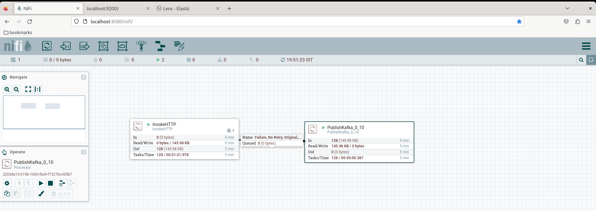
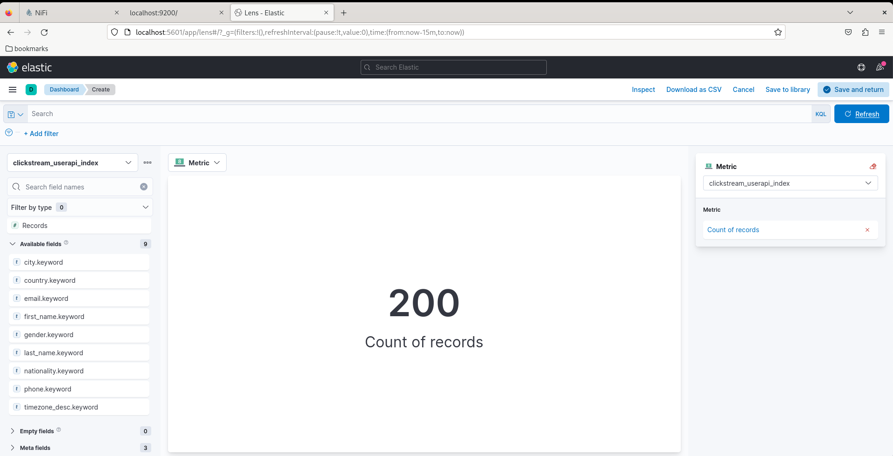

# 🚀 Real-Time Streaming Project (End-to-End)

This document describes a **working real-time streaming pipeline** using **Kafka, NiFi, PySpark Structured Streaming, Elasticsearch, and Kibana**.

---

## 📌 Architecture Overview

```
API (randomuser.me)
        ↓
     Apache NiFi
        ↓
     Apache Kafka
        ↓
 PySpark Structured Streaming
        ↓
   Elasticsearch
        ↓
      Kibana Dashboard
```

---

## 🔧 Prerequisites & Service Startup

### 1️⃣ Start Zookeeper

```bash
zookeeper-server-start.sh -daemon /usr/local/kafka/config/zookeeper.properties
jps | grep "QuorumPeerMain"
```

---

### 2️⃣ Start Kafka Cluster (Multi-Broker)

```bash
kafka-server-start.sh -daemon /usr/local/kafka/config/server.properties
kafka-server-start.sh -daemon /usr/local/kafka/config/server-1.properties
kafka-server-start.sh -daemon /usr/local/kafka/config/server-2.properties
jps | grep "Kafka"
```

---

### 3️⃣ Create Kafka Topic

```bash
kafka-topics.sh --create \
  --zookeeper localhost:2181 \
  --replication-factor 3 \
  --partitions 3 \
  --topic clickstream_userapi

kafka-topics.sh --list --zookeeper localhost:2181
```

---

### 4️⃣ Start Apache NiFi

```bash
nifi.sh start
```

* NiFi UI: [http://localhost:8080/nifi](http://localhost:8080/nifi)

---

### 5️⃣ Start Elasticsearch

```bash
cd /home/hduser/install/elasticsearch-7.17.18/bin
nohup ./elasticsearch &
```

* Elasticsearch URL: [http://localhost:9200](http://localhost:9200)

---

### 6️⃣ Start Kibana

```bash
cd /home/hduser/install/kibana-7.17.18-linux-aarch64/bin/
nohup ./kibana &
```

* Kibana URL: [http://localhost:5601](http://localhost:5601)

---

## 🌐 Real-Time API Data Source

**API Endpoint**:

```
http://api.randomuser.me/
```

### Sample Payload

```json
{
  "results": [
    {
      "gender": "male",
      "name": {
        "title": "Mr",
        "first": "Jonathan",
        "last": "Sørensen"
      },
      "location": {
        "street": {
          "number": 8054,
          "name": "Porsevej"
        },
        "city": "Rønnede",
        "state": "Sjælland",
        "country": "Denmark",
        "postcode": 35279,
        "coordinates": {
          "latitude": "-41.8937",
          "longitude": "-170.8907"
        },
        "timezone": {
          "offset": "+5:30",
          "description": "Bombay, Calcutta, Madras, New Delhi"
        }
      },
      "email": "jonathan.sorensen@example.com",
      "phone": "27981954",
      "nat": "DK"
    }
  ],
  "info": {
    "seed": "d7e4f4ce2a157b6c",
    "results": 1,
    "page": 1,
    "version": "1.4"
  }
}
```

---

## 🔄 NiFi → Kafka (Real-Time Ingestion)

### NiFi Flow Design

1. **Create a new Process Group**
2. Add the following processors:

   * **InvokeHTTP** (to pull data from API)
   * **PublishKafka** (to publish messages to Kafka topic)
3. Configure:

   * API endpoint in `InvokeHTTP`
   * Kafka brokers & topic in `PublishKafka`
4. Connect processors and start the flow

<details>
  <summary> Click to view the screenshot</summary>
  
</details>

---

### 🔍 Validation: Kafka Consumer Test

```bash
kafka-console-consumer.sh \
  --bootstrap-server localhost:9092 \
  --topic clickstream_userapi
```

✔️ Confirms real-time messages are arriving in Kafka

---

## ⚡ PySpark Streaming: Kafka → Elasticsearch

### Spark Submit Command

```bash
spark-submit \
 --packages org.apache.spark:spark-sql-kafka-0-10_2.12:3.1.2,org.elasticsearch:elasticsearch-spark-30_2.12:7.12.0 \
 /home/hduser/apache-kafka/project-kafka_es_stream.py
```

---

### PySpark Structured Streaming Code

```python
from pyspark.sql import SparkSession
from pyspark.sql.functions import from_json, col, explode
from pyspark.sql.types import StructType, ArrayType, StringType, MapType

# Configuration
KAFKA_BOOTSTRAP_SERVERS = "localhost:9092"
KAFKA_TOPIC = "clickstream_userapi"
ELASTICSEARCH_NODES = "localhost"
ELASTICSEARCH_PORT = "9200"
ES_INDEX_NAME = "clickstream_userapi_index/random_user"
CHECKPOINT_LOCATION = "/tmp/spark/checkpoints/user_data"

# Schemas
name_schema = StructType() \
    .add("title", StringType()) \
    .add("first", StringType()) \
    .add("last", StringType())

location_timezone_schema = StructType() \
    .add("offset", StringType()) \
    .add("description", StringType())

location_schema = StructType() \
    .add("city", StringType()) \
    .add("country", StringType()) \
    .add("timezone", location_timezone_schema)

user_schema = StructType() \
    .add("gender", StringType()) \
    .add("name", name_schema) \
    .add("location", location_schema) \
    .add("email", StringType()) \
    .add("phone", StringType()) \
    .add("nat", StringType())

payload_schema = StructType() \
    .add("results", ArrayType(user_schema)) \
    .add("info", MapType(StringType(), StringType()))

# Spark Session
spark = SparkSession.builder \
    .appName("KafkaToElasticsearchStream") \
    .config("spark.es.nodes", ELASTICSEARCH_NODES) \
    .config("spark.es.port", ELASTICSEARCH_PORT) \
    .getOrCreate()

spark.sparkContext.setLogLevel("ERROR")

# Read from Kafka
df_kafka = spark.readStream \
    .format("kafka") \
    .option("kafka.bootstrap.servers", KAFKA_BOOTSTRAP_SERVERS) \
    .option("subscribe", KAFKA_TOPIC) \
    .load()

# Parse JSON
df_parsed = df_kafka.selectExpr("CAST(value AS STRING)") \
    .select(from_json(col("value"), payload_schema).alias("data"))

# Explode results array
df_final = df_parsed.select(explode(col("data.results")).alias("user")) \
    .select(
        col("user.gender"),
        col("user.email"),
        col("user.phone"),
        col("user.nat").alias("nationality"),
        col("user.name.first").alias("first_name"),
        col("user.name.last").alias("last_name"),
        col("user.location.city"),
        col("user.location.country"),
        col("user.location.timezone.description").alias("timezone_desc")
    )

# Write to Elasticsearch
df_final.writeStream \
    .format("org.elasticsearch.spark.sql") \
    .option("es.resource", ES_INDEX_NAME) \
    .option("es.mapping.id", "email") \
    .option("checkpointLocation", CHECKPOINT_LOCATION) \
    .trigger(processingTime="5 seconds") \
    .start() \
    .awaitTermination()
```

---

## 📊 Kibana: Live Dashboard & Visualization

### Steps

1. **Kibana → Management → Index Patterns**

   * Create index pattern: `clickstream_userapi_index*`

2. **Analytics → Discover**

   * Select index: `clickstream_userapi_index`
   * View real-time incoming records

3. **Analytics → Dashboard**

   * Create visualizations
   * Metric visualization → **Document Count**

✔️ Live streaming data visible in Kibana

<details>
  <summary> Click to view the screenshot</summary>
   
</details>


---

## ✅ Final Outcome

* Real-time API data ingestion
* Kafka-based streaming pipeline
* PySpark Structured Streaming processing
* Elasticsearch indexing
* Live Kibana dashboards

🎯 **End-to-End Real-Time Streaming Project Successfully Implemented**
