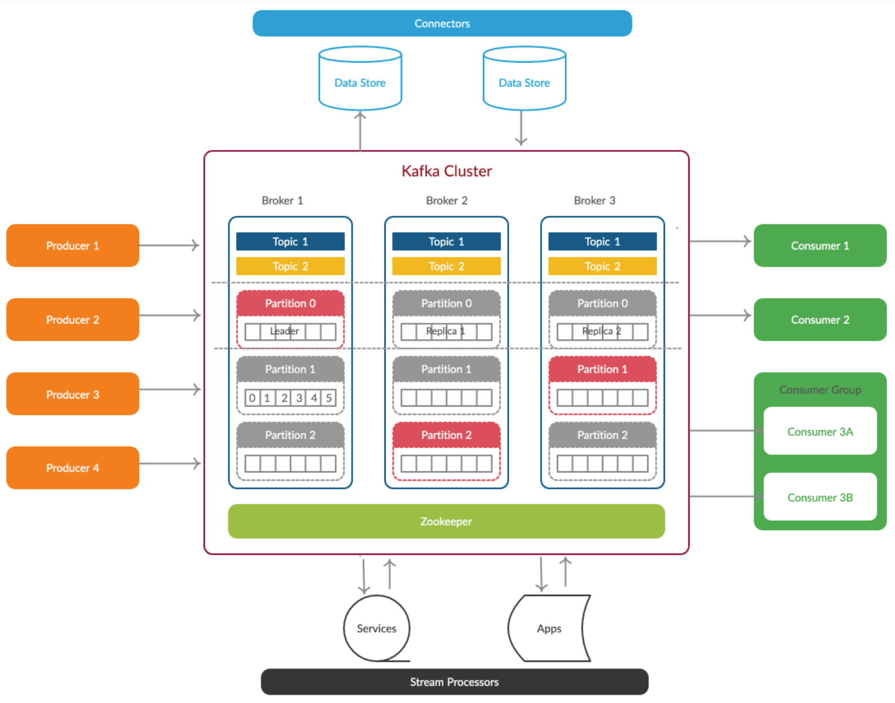

# Apache Kafka

## NiFi and Kafka are powerful data tools often used together:

1.  **Apache NiFi** (from its origins at Niagara Falls Power Company) is a **data flow management tool** for **visually designing, directing, and automating data movement with processing** (enriching, filtering) and traceability.
2.  While **Apache Kafka** (name chosen by its creator, LinkedIn engineer Jay Kreps, inspired by Franz Kafka) is a **distributed streaming platform** for building **real-time pipelines and apps, acting as a high-throughput, fault-tolerant message broker (publish/subscribe system)** for live data streams.
3.  NiFi excels at **getting data from diverse sources and preparing it, while Kafka excels at transporting and organizing massive streams of data in real-time**; NiFi can even read from and write to Kafka topics as a producer or consumer.

## Architectures:

1.  Hierarchical
    * Master Slave - Hadoop (Name Node - Data Nodes)
2.  Flat Hierarchy
    * P2P (Peer To Peer) - Kafka (Brokers)

## Kafka Introduction:

a. **PubSub/Kafka/EventHub** is a leading general purpose **publish-subscribe or producer-consumer, distributed messaging system**, which offers, linear scalability, strong durability and fault-tolerance support.
b. Designed for handling of **real time activity** stream data such as logs, metrics collections.
c. Written in **Scala**
d. An Apache project initially developed in **LinkedIn** at the year 2007 then to Apache in 2012 by **Jay Kreps** in the name of **Franz Kafka**
e. It is **not specifically designed for Hadoop** rather Hadoop ecosystem is just be one of its possible consumers.




This document outlines the steps for installing both **Apache Kafka** and **Apache NiFi** on your VM, including crucial troubleshooting steps encountered during the Kafka setup.

## 📥 1. Kafka Installation & Troubleshooting

The Kafka installation involves downloading, extracting, and starting the services. The steps clearly show a common dependency issue that requires a fix.

### Installation Steps

1.  **Download Kafka:** Navigate to the download path and retrieve the Kafka tarball.
    ```bash
    cd /home/hduser/install/
    wget https://archive.apache.org/dist/kafka/0.10.2.2/kafka_2.11-0.10.2.2.tgz
    ```
2.  **Extract and Move:** Extract the tarball and move the contents to the standard local installation path.
    ```bash
    sudo rm -rf /usr/local/kafka
    tar xvzf kafka_2.11-0.10.2.2.tgz
    sudo mv kafka_2.11-0.10.2.2 /usr/local/kafka
    ```

### Service Startup & Troubleshooting

3.  **Start ZooKeeper:** Start the Zookeeper Coordination service in daemon mode.
    ```bash
    zookeeper-server-start.sh -daemon /usr/local/kafka/config/zookeeper.properties
    ```
4.  **Start Kafka:** Start the single Kafka server in daemon mode.
    ```bash
    kafka-server-start.sh -daemon /usr/local/kafka/config/server.properties
    ```

### Java Compatibility Fix (JAXB Dependency)

The Kafka startup encountered a Java compatibility error: `java.lang.NoClassDefFoundError: javax/xml/bind/DatatypeConverter`. This issue occurs when running older Kafka versions on newer Java environments (Java 9/11+). The fix requires manually adding the **JAXB** (Java Architecture for XML Binding) libraries to the Kafka classpath.

  * **Download JAXB Libraries:**
    ```bash
    wget https://repo1.maven.org/maven2/javax/xml/bind/jaxb-api/2.3.1/jaxb-api-2.3.1.jar
    wget https://repo1.maven.org/maven2/org/glassfish/jaxb/jaxb-runtime/2.3.1/jaxb-runtime-2.3.1.jar
    ```
  * **Copy to Kafka Libs:**
    ```bash
    sudo cp jaxb-api-2.3.1.jar /usr/local/kafka/libs/
    sudo cp jaxb-runtime-2.3.1.jar /usr/local/kafka/libs/
    ```

### Verification

After applying the fix and restarting the services, the `jps` command confirms both services are running alongside other processes (like Hadoop and NiFi).

| Process ID | Service Name |
| :--- | :--- |
| `10557` | `QuorumPeerMain` (ZooKeeper) |
| `11951` | `Kafka` |

## ⬇️ 2. NiFi Installation

The steps for installing Apache NiFi involve downloading the binary, extracting, moving, and starting the service.

1.  **Download NiFi:** Navigate to the download path and retrieve the NiFi tarball.
    ```bash
    cd /home/hduser/install
    wget https://archive.apache.org/dist/nifi/1.1.0/nifi-1.1.0-bin.tar.gz
    tar xvzf nifi-1.1.0-bin.tar.gz
    ```
2.  **Move to Required Folder:** Move the extracted NiFi directory to the standard local installation path.
    ```bash
    sudo mv nifi-1.1.0 /usr/local/nifi
    ```
3.  **Start NiFi Server:** Start the NiFi server.
    ```bash
    nifi.sh start
    ```
4.  **Access Web UI:** Access the NiFi web interface via the specified address.
    ```bash
    http://localhost:8080/nifi
    ```

-----
e to proceed with a tutorial on how to configure NiFi to consume data from your new Kafka topic?